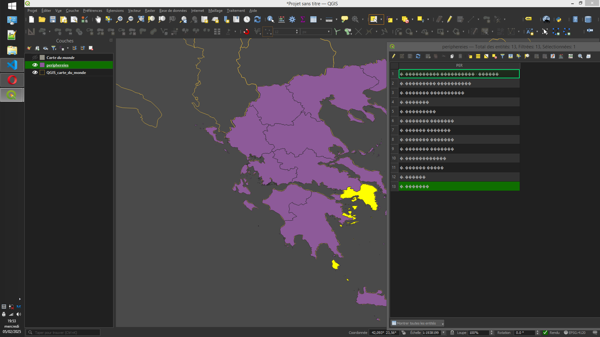
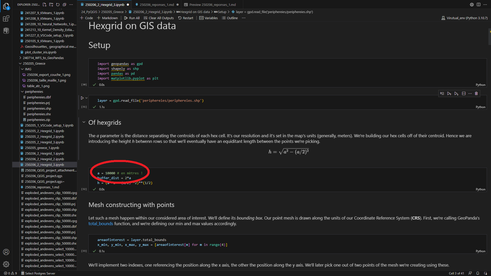
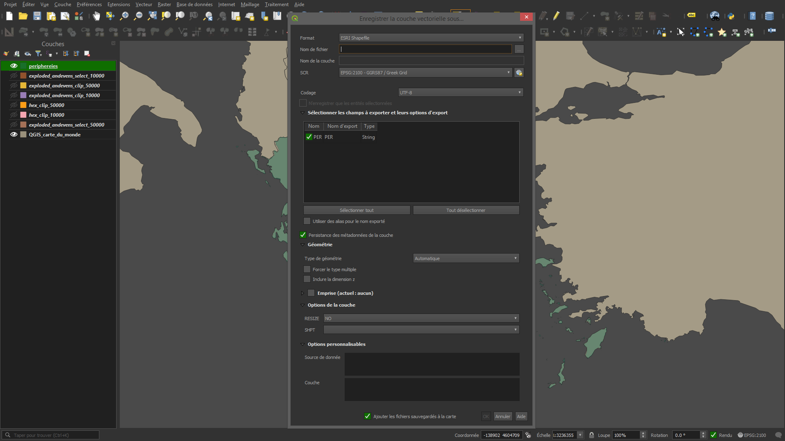

5 février 2025, Adrien Gahéry

Nous avons effectiement discuté de leur projet vendredi 31 janvier. C'est un projet ambitieux. Je me demande quel sera le moyen de visualisation du produit fini ? Serait-ce un plugin de carto-web? 

# considérations générales

## projection cartographique

Va falloir se coltiner quelques rappels, car il y a une petite difficulté avec QGIS et le système légal de projection de le Grèce.

La terre est une sphère, on exprime ses coordonnées en longitude/latitude. On se réfère à ce système de coordonnées comme WGS84 (EPSG:4326). Or, nos cartes sont plates, il faut passer de la réalité géodésique aux cartes. Leurs coordonnées sont en mètres, pour les Grecs comme pour nous. Nous appartenons à différentes parties du globe, donc la projection va être différente d'un pays à l'autre. 

Chaque projection possède ses propres coordonnées, qui sont parfaitement arbitraires. Chacun a un nom arbitraire, voire fantaisiste (par exemple CSG67 pour "Centre Spatial Guyanais 1967"), mais l'index commun EPSG donne à chacune un numéro unique. Les unités de la cartes sont bien des mètres, mais le point en bas à gauche de la carte est rarement de coordonnées (0,0). La projection elle même relève d'équations mathématiques différentes, donc elle va *déformer* les coordonnées longitude/latitude différamment. Les données géographiques sont enregistrées avec les coordonnées projetées. Il faut faire attention au système de projection. 

**Les calculs sur les géométries se font sur des données cartographiques**, c'est à dire pas sur des fichiers en WGS84(EPSG 4326). 

## de la donnée géographique

### vecteur

SVG / Json : La technologie des images vecteur existe bel et bien pour les données géographiques. Il existe 3 types de représentation: Points, lignes, ou polygones (surfaces). Ces infrmations sont enregistrées directement dans le tracé des données vecteur: dans QGIS, le curseur de la souris indique directement les coordonnées que l'on pointe. Pas besoin à priori d'enregistrer les coordonnées des points, le logiciel les connait *nativement*.

On peut ainsi conduire des sélections par localisation, pour savoir quelle donnée *intersecte* (recouvre) quelle autre donnée, contenue par exemple dans une autre couche.

À chaque objet de la cartographie correspond un individu dans la table attributaire de la donnée. Traditionnellement, les données ont le même type de géométrie: point, ligne, surface. 

*deux fenêtres pour afficher les informations d'une donnée. Vous avez l'encodage grec sur votre PC*

### Raster

Ce sont des images, dont chaque pixel est géo-référencé. Un format: jpeg-2000 par exemple, qui peut tout aussi bien être ouvert avec un éditeur d'iamge ordinaire que par QGIS, qui va le placer correctement sur la carte du monde. Attention, la reprojection de ces couches est compliquée, puisqu'il s'agit de déformer des pixels. Je ne suis pas expert, mais je vous renvoie vers GRASS GIS si vous souhaitez malgré tout vous y coller.

## Quelques formats logiciels

Le standard historique est la donnée ShapeFile, qui est un format robuste. Il s'agit d'un ensemble de 5 fichiers au même nom, chacun apportant un type d'information à la donnée qu'affiche QGIS (équivalent ARGGIS, mais gratuit et aussi performant).
- le dessin vecteur (.shp et .shx)
- les données attributaires, reliées à chacun des entités vecteurs (.dbf)
- la donnée de projection (.prj)
- un DOCTYPE (.qmd)
J'aime ce format, car je peux très facilement bidouiller mes données. Le dbf s'ouvre avec n'importe quel tableur, et contient la table attributaire telle qu'elle est affichée dans QGIS.

L'autre format est bien tiré du JSON, le [GeoJSON](https://en.wikipedia.org/wiki/GeoJSON). Il stocke les donnée selon des balises, de type technologie web. Ce fichier ne contient pas les informations liées à la projection de la donnée, c'est la raison pour laquelle la convention est d'utiliser comme coordonnées la longitude/latitude (donnée non projetée). **Mais** rien ne vous emêche d'utiliser les données projetées cartographiques avec la projection "à plat" dus sytème grec. Je que j'entends, c'est que vous pouvez peut être adopter le système de coordonnées cartographique comme système de coordonnées de l'échiquier du jeu. Pour ce faire, rien de plus simple: enregistrez la donnée géographique à tout sauf à WGS 84(EPSG:4326P). 

Introduction aux données vecteur par la [documentation](https://docs.qgis.org/3.34/fr/docs/gentle_gis_introduction/vector_data.html) de QGIS.

# Données livrées

## projet QGIS

Les données que je vous fournis sont enregistrées au système officiel HGRS87(EPSG 2100). J'ai constituté un projet QGIS, avec les données hexagonales que je produis. Il s'agit de données au format vecteur. La fin de leur nom indique la taille de la maille (en mètres) que j'ai utilisé.

*taille de la maille*

Pour modifier la taille de la maille *a*, vous n'avez qu'à modifier le paramètre *a* de mon Notebook, et ça va enregistrer le shapefile correspondant avec la taille de la maille comme indice

*On ne touche que ça ! Le reste se fait tout seul*

Ce traitement de la donnée est une utilisation avancée du logiciel, le reste des opérations ([intersection](https://docs.qgis.org/3.34/en/docs/user_manual/processing_algs/qgis/vectoroverlay.html), [édition de la table attributaire](https://docs.qgis.org/3.34/en/docs/user_manual/working_with_vector/attribute_table.html)) peut se faire via QGIS.

Je vous fournis également le jupyter Notebook qui m'a permis de faire ce traitement, ainsi que celui qui permet d'installer les outils nécessaires. Les attributs de la table ont deux colonnes, mais ils sont facilement par QGIS

## transformation de SHP en image vecteur

*les quelques formats disponibles pour l'enregistrement d'une couche*

[stackoverflow](https://stackoverflow.com/questions/4222610/shapefile-arcinfo-to-svg-preferably-in-python) vient à ma rescousse, il existe un lien non erroné vers un dépot GIt nommé [kartograph.py](https://github.com/kartograph/kartograph.py) qui permet de le faire. Je ne l'ai pas testé.

# Bonus

## la projection cartographique pour les données Web

Pour afficher une donnée géographique dans un projet de webcarto, la projection utilisée est "pseudo-Mercator" (EPSG: 3857), devenue le standard pour l'affichage de données vecteur pour le web.

## les moteurs de jeux vidéos

Unreal Engine ou Unity sont deux solutions pour la création de jeux vidéos. C'est gratuit. Unreal Engine propose des [BluePrints RTS] pour créer son jeu de stratégie, mais c'est un Tower-defense. 
Unreal Engine rendu de cartos par des matériaux sur Unreal Engine: le [cours](https://www.artstation.com/learning/series/6E/creating-materials-in-unreal-engine) de Kem Yaralioglu.